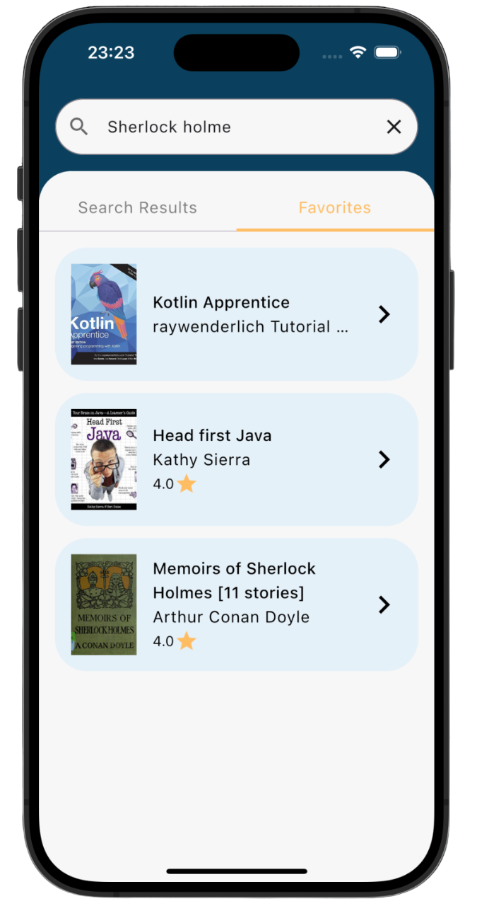

# Chapterly 📚

A modern multiplatform Kotlin application that allows users to search for books, view detailed information, and manage their favorite books across Android, iOS, and Desktop platforms.

## 🌟 Features

- **Book Search**: Search for books using the Open Library API
- **Book Details**: View comprehensive book information including ratings, pages, languages, and descriptions
- **Favorites Management**: Add and remove books from your personal favorites list
- **Cross-Platform**: Native experience on Android, iOS, and Desktop
- **Offline Support**: Local database storage for favorite books
- **Modern UI**: Built with Jetpack Compose Multiplatform and Material 3 design

## 📱 Screenshots

### Android
<div align="center">
  
  
  
</div>

### iOS
<div align="center">
  
  
  
</div>

### Desktop
<div align="center">
  
  
  
</div>

## 🏗️ Architecture

The app follows a clean architecture pattern with clear separation of concerns:

- **Presentation Layer**: Jetpack Compose UI with ViewModels
- **Domain Layer**: Business logic and use cases
- **Data Layer**: Repository pattern with local and remote data sources
- **Dependency Injection**: Koin for dependency management

## 🛠️ Tech Stack

### Core Framework
- **Kotlin Multiplatform Mobile (KMM)**: Cross-platform development
- **Jetpack Compose Multiplatform**: Modern declarative UI framework
- **Kotlin**: 2.2.20

### Networking & Data
- **Ktor**: 3.3.1 - HTTP client for API calls
- **Kotlinx Serialization**: JSON serialization/deserialization
- **Open Library API**: Book search and details

### Local Storage
- **Room**: 2.8.3 - Local database for favorites
- **SQLite**: 2.6.1 - Database engine
- **KSP**: 2.2.20-2.0.4 - Code generation for Room

### Dependency Injection
- **Koin**: 4.1.1 - Dependency injection framework

### Image Loading
- **Coil**: 3.3.0 - Image loading and caching

### Navigation
- **Navigation Compose**: 2.9.0 - Type-safe navigation

### Logging
- **Kermit**: 2.0.2 - Cross-platform logging

### UI Components
- **Material 3**: Modern design system
- **Material Icons Extended**: 1.7.3 - Extended icon set

## 📦 Dependencies

### Common Dependencies
```kotlin
// Core Compose
implementation(compose.runtime)
implementation(compose.foundation)
implementation(compose.material3)
implementation(compose.ui)

// Navigation
implementation(libs.jetbrains.compose.navigation)

// Dependency Injection
implementation(libs.koin.compose)
implementation(libs.koin.compose.viewmodel)
api(libs.koin.core)

// Networking
implementation(libs.bundles.ktor)
implementation(libs.kotlinx.serialization.json)

// Image Loading
implementation(libs.bundles.coil)

// Local Storage
implementation(libs.androidx.room.runtime)
implementation(libs.sqlite.bundled)

// Logging
implementation("co.touchlab:kermit:2.0.2")
```

### Platform-Specific Dependencies

#### Android
```kotlin
implementation(libs.koin.android)
implementation(libs.koin.androidx.compose)
implementation(libs.ktor.client.okhttp)
```

#### iOS
```kotlin
implementation(libs.ktor.client.darwin)
```

#### Desktop
```kotlin
implementation(compose.desktop.currentOs)
implementation(libs.kotlinx.coroutinesSwing)
implementation(libs.ktor.client.okhttp)
```

## 🚀 Getting Started

### Prerequisites
- Android Studio Hedgehog or later
- Xcode 15+ (for iOS development)
- JDK 11 or later
- Kotlin 2.2.20

### Building the Project

1. **Clone the repository**
   ```bash
   git clone <repository-url>
   cd Chapterly
   ```

2. **Build for Android**
   ```bash
   ./gradlew :composeApp:assembleDebug
   ```

3. **Build for iOS**
   ```bash
   ./gradlew :composeApp:linkDebugFrameworkIosArm64
   # Then open iosApp/iosApp.xcodeproj in Xcode
   ```

4. **Build for Desktop**
   ```bash
   ./gradlew :composeApp:run
   ```

### Running the App

- **Android**: Run the `composeApp` module in Android Studio
- **iOS**: Open `iosApp/iosApp.xcodeproj` in Xcode and run
- **Desktop**: Run the desktop application from Android Studio or command line

## 📁 Project Structure

```
composeApp/
├── src/
│   ├── commonMain/
│   │   ├── kotlin/
│   │   │   ├── app/                    # App entry point and navigation
│   │   │   ├── book/                   # Book domain and presentation
│   │   │   │   ├── data/              # Data layer (network, database, mappers)
│   │   │   │   ├── domain/            # Domain models and repository
│   │   │   │   └── presentation/     # UI screens and ViewModels
│   │   │   ├── core/                  # Core utilities and domain
│   │   │   └── di/                   # Dependency injection modules
│   │   └── composeResources/          # Resources (strings, drawables)
│   ├── androidMain/                  # Android-specific code
│   ├── iosMain/                      # iOS-specific code
│   ├── jvmMain/                      # Desktop-specific code
│   └── nativeMain/                   # Native-specific code
└── schemas/                          # Room database schemas
```

## 🔧 Key Components

### Data Sources
- **RemoteBookDataSource**: Handles API calls to Open Library
- **FavoriteBookDao**: Manages local database operations
- **BookRepository**: Coordinates between remote and local data sources

### UI Screens
- **BookListScreen**: Search and browse books with tabbed interface
- **BookDetailScreen**: Detailed book information and favorite management

### State Management
- **BookListViewModel**: Manages search state and favorites
- **BookDetailViewModel**: Handles book details and favorite actions

## 🌐 API Integration

The app integrates with the **Open Library API** to provide:
- Book search functionality
- Detailed book information
- Book covers and metadata
- Author information and ratings

## 💾 Local Storage

- **Room Database**: Stores favorite books locally
- **Offline Support**: Favorites persist across app sessions
- **Data Synchronization**: Seamless sync between local and remote data

## 🎨 UI/UX Features

- **Material 3 Design**: Modern, accessible interface
- **Responsive Layout**: Adapts to different screen sizes
- **Dark/Light Theme**: System theme support
- **Smooth Animations**: Polished user experience
- **Error Handling**: User-friendly error messages

## 🔮 Future Enhancements

- User authentication and profiles
- Reading lists and bookmarks
- Book recommendations
- Social features (sharing, reviews)
- Offline reading capabilities
- Advanced search filters

## 📄 License

This project is licensed under the MIT License - see the LICENSE file for details.

## 🤝 Contributing

Contributions are welcome! Please feel free to submit a Pull Request.

## 📞 Support

For support, drop me a mail or create an issue in the repository.

---

Built with ❤️ using Kotlin Multiplatform Mobile